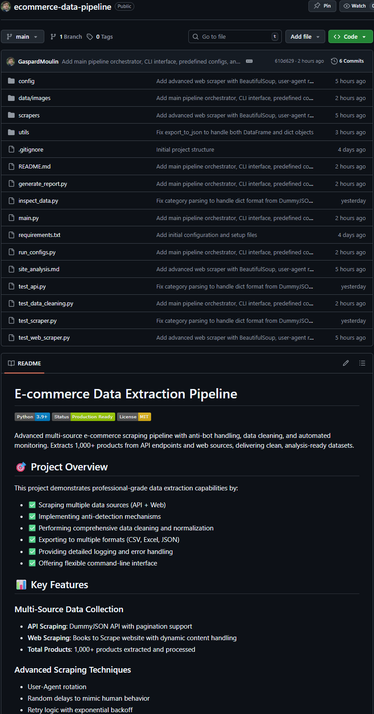
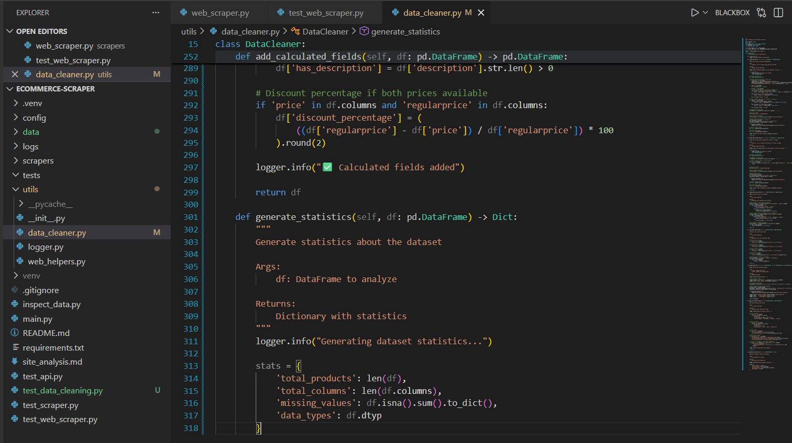

# Portfolio Screenshots Reference

This document lists all screenshots to include in your portfolio presentation.

## Essential Screenshots (Must Have)

### 1. Project Structure
**File:** Screenshot #1  
**What to show:** VS Code/IDE showing complete project structure  
**Purpose:** Demonstrates organized, professional architecture  
**Portfolio caption:** "Modular project architecture with clear separation of concerns"

### 2. Main Pipeline Execution
**File:**  
**What to show:** Terminal showing complete pipeline run with all 4 phases  
**Purpose:** Shows working system with real-time progress  
**Portfolio caption:** "Automated pipeline extracting 1,000+ products in minutes"

### 3. Data Output (Excel)
**File:** Screenshot #20  
**What to show:** Excel file open with cleaned data and multiple columns  
**Purpose:** Demonstrates clean, structured output  
**Portfolio caption:** "Clean, analysis-ready dataset with 30+ attributes per product"

### 4. GitHub Repository
**File:** Screenshot #29  
**What to show:** GitHub repo homepage with README and badges  
**Purpose:** Shows professional documentation and code quality  
**Portfolio caption:** "Production-ready code with comprehensive documentation"

### 5. Analysis Report
**File:** Screenshot #22  
**What to show:** Generated markdown report with statistics  
**Purpose:** Demonstrates analytical capabilities  
**Portfolio caption:** "Automated analysis report with key insights and metrics"

## Supporting Screenshots (Nice to Have)

### 6. API Scraper Code
**File:** Screenshot #7  
**What to show:** api_scraper.py open showing clean, documented code  
**Purpose:** Demonstrates coding skills  
**Portfolio caption:** "Professional Python code with type hints and documentation"

### 7. Web Scraper Code
**File:** Screenshot #14  
**What to show:** web_scraper.py showing anti-detection mechanisms  
**Purpose:** Shows advanced scraping techniques  
**Portfolio caption:** "Advanced web scraping with user-agent rotation and rate limiting"

### 8. Data Cleaner Code
**File:** Screenshot #18  
**What to show:** data_cleaner.py showing data processing methods  
**Purpose:** Demonstrates data engineering skills  
**Portfolio caption:** "Robust data cleaning with pandas and quality assurance"

### 9. CLI Interface
**File:** Screenshot #26  
**What to show:** Terminal showing --help output with all options  
**Purpose:** Shows user-friendly interface  
**Portfolio caption:** "Flexible command-line interface for various use cases"

### 10. Log Files
**File:** Screenshot #9  
**What to show:** Detailed log file with timestamps and status messages  
**Purpose:** Demonstrates production-ready monitoring  
**Portfolio caption:** "Comprehensive logging system for debugging and monitoring"

## Additional Screenshots for Deep Dive

### 11. Site Analysis
**File:** Screenshot #12  
**What to show:** site_analysis.md document  
**Portfolio caption:** "Thorough analysis before implementation"

### 12. Configuration Files
**File:** Screenshot #4  
**What to show:** settings.py with configuration options  
**Portfolio caption:** "Centralized configuration management"

### 13. Data Helpers
**File:** Screenshot #13  
**What to show:** web_helpers.py utility functions  
**Portfolio caption:** "Reusable utility functions for scalability"

### 14. Test Results
**File:** Screenshot #19  
**What to show:** Terminal showing successful test execution  
**Portfolio caption:** "Comprehensive testing for reliability"

### 15. Processed Data Directory
**File:** Screenshot #21  
**What to show:** File explorer with all exported formats  
**Portfolio caption:** "Multi-format export for maximum flexibility"

## How to Use These Screenshots

### For Portfolio Website
1. Use screenshots #1, #25, #20, #29, #22 as hero images
2. Create a gallery with remaining screenshots
3. Add captions explaining technical details
4. Include code snippets alongside relevant screenshots

### For Resume/CV
1. Reference the GitHub repository
2. Include 1-2 key screenshots showing results
3. Focus on metrics and outcomes

### For LinkedIn Post
1. Lead with screenshot #25 (pipeline execution)
2. Include screenshot #20 (data output)
3. End with screenshot #29 (GitHub repo)
4. Write engaging captions focusing on business value

### For Job Applications
1. Include link to GitHub repository
2. Attach screenshot #29 (GitHub with README)
3. Optionally attach screenshot #22 (analysis report)
4. Reference other screenshots as "available upon request"

## Screenshot Quality Checklist

Before using screenshots in your portfolio, ensure:

- [ ] High resolution (at least 1920x1080)
- [ ] Clear, readable text
- [ ] No sensitive information visible
- [ ] Proper window/terminal sizing
- [ ] Consistent theme/styling
- [ ] Good contrast and visibility
- [ ] Professional appearance
- [ ] Relevant content fully visible

## Creating Additional Screenshots

If you need more screenshots:

### Demo Video Screenshots
1. Record screen during pipeline execution
2. Capture key moments
3. Use video editing software to extract frames

### Before/After Comparisons
1. Show raw data vs cleaned data
2. Highlight data quality improvements
3. Display statistics side-by-side

### Architecture Diagrams
1. Create flowcharts showing pipeline flow
2. Use draw.io or similar tools
3. Export as high-quality images

## Presentation Tips

### Do:
✅ Use high-quality images
✅ Add descriptive captions
✅ Highlight key features
✅ Show real results
✅ Include context

### Don't:
❌ Use blurry screenshots
❌ Show errors or failures
❌ Include sensitive data
❌ Overcrowd with too many images
❌ Use without explanation

## File Naming Convention

Rename your screenshot files for easy reference:
```
01_project_structure.png
02_pipeline_execution.png
03_data_output_excel.png
04_github_repository.png
05_analysis_report.png
06_api_scraper_code.png
07_web_scraper_code.png
08_data_cleaner_code.png
09_cli_interface.png
10_log_files.png
```

## Storage and Organization

Create a `portfolio_assets/` folder:
```
portfolio_assets/
├── screenshots/
│   ├── 01_project_structure.png
│   ├── 02_pipeline_execution.png
│   └── ...
├── code_samples/
│   ├── api_scraper_snippet.py
│   └── data_cleaner_snippet.py
└── reports/
    ├── sample_output.csv
    └── analysis_report.md
```

---

**Remember:** Screenshots should tell a story about your technical skills, problem-solving abilities, and the value you delivered through this project.